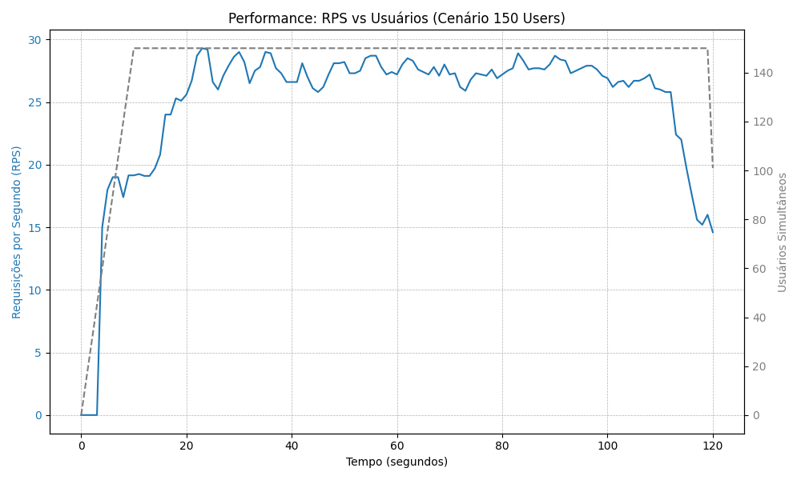
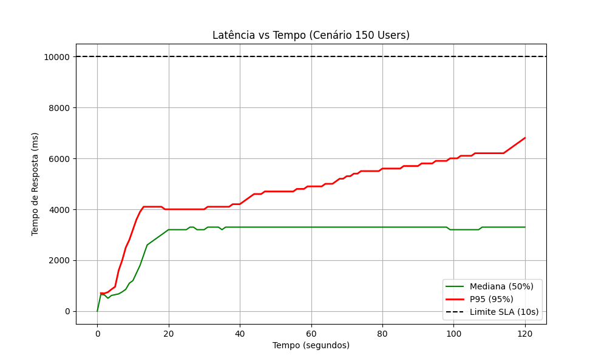

# AWS WordPress Benchmark: Tuning e Análise de Escalabilidade

Este repositório contém os artefatos, scripts e resultados do projeto de Benchmarking de um cluster WordPress na AWS. O objetivo foi maximizar a capacidade de atendimento (usuários simultâneos) respeitando um SLA de latência (< 10s) e um orçamento estrito de infraestrutura (< US$ 0.50/h).

## 👨‍💻 Identificação
* **Nome:** Rener Menezes
* **Matrícula:** 2519170
* **Curso:** Mestrado em Informática Aplicada - UNIFOR
* **Disciplina:** Computação em Nuvem

---

## 🚀 1. Estratégia Adotada

Para atingir os objetivos de performance, adotamos uma estratégia híbrida de **Escalabilidade Horizontal (Scale-out)** combinada com **Tuning Agressivo de Software**.

* **Por que Scale-out?**
    Utilizamos **5 instâncias `c5.large`** para a camada de aplicação. A escolha da família `c5` (Compute Optimized) foi fundamental para lidar com o processamento PHP do WordPress, enquanto a distribuição em 5 nós permitiu paralelizar o atendimento das requisições via Load Balancer.

* **Por que Tuning de Software?**
    Apenas escalar as máquinas não foi suficiente. Nos testes iniciais, o sistema falhou com gargalos de I/O de disco e conexões de banco de dados, mesmo com CPU sobrando. O tuning foi necessário para remover travas lógicas no Apache e no MariaDB.

---

## 🏗️ 2. Arquitetura Final

A infraestrutura final que sustentou a carga máxima foi composta por:

* **Aplicação (Auto Scaling Group):** 5x instâncias `c5.large` (2 vCPU, 4GB RAM).
* **Banco de Dados:** 1x instância `c5.large` (2 vCPU, 4GB RAM).
* **Sistema Operacional:** Amazon Linux 2.
* **Servidor Web:** Apache 2.4 com PHP 7.2.
* **Banco de Dados:** MariaDB 10.2.

### 🔧 Detalhes do Tuning

Para atingir a performance final, aplicamos as seguintes otimizações críticas via scripts de `user_data`:

#### A. Camada de Banco de Dados (MariaDB)
O gargalo principal era o I/O do disco EBS (IOPS).
* `innodb_flush_log_at_trx_commit = 2`: **Crucial.** Mudamos a escrita em disco de "tempo real" para "cada 1 segundo". Isso aumentou a velocidade de escrita em ~10x.
* `max_connections = 2000`: Aumentado de 151 (padrão) para evitar erros de conexão recusada com 5 servidores web.
* `innodb_buffer_pool_size = 2G`: Ajustado para usar 50% da RAM dedicada ao cache.
* `skip-name-resolve`: Desativado o DNS reverso para diminuir latência de rede.

#### B. Camada de Aplicação (Apache/PHP)
O gargalo era o gerenciamento de memória e a latência com o Load Balancer.
* `ServerLimit` / `MaxRequestWorkers = 150`: Calculado para ocupar a RAM disponível (4GB) sem causar *swap*.
* `KeepAliveTimeout = 5`: Aumentado para manter conexões persistentes com o Load Balancer, reduzindo o *overhead* de *TCP Handshake*.
* **Logs Desativados:** `CustomLog` comentado para evitar que a escrita de logs de acesso saturasse o I/O do disco da aplicação.

---

## 📊 3. Resultados Obtidos

Realizamos uma bateria de testes progressivos ("Step-up Test") para determinar o Ponto de Ruptura do sistema.

### Capacidade Máxima Sustentada: **150 Usuários**

| Métrica | Resultado | Limite/SLA | Status |
| :--- | :--- | :--- | :--- |
| **RPS Máximo** | ~25.6 req/s | N/A | ✅ Estável |
| **Latência P95** | **6.800 ms** | < 10.000 ms | ✅ Aprovado |
| **Taxa de Erro** | **0.00%** | < 1% | ✅ Aprovado |

### Histórico de Testes (Determinação do Limite)

| Cenário (Usuários) | Latência P95 | Taxa de Erro | Conclusão |
| :--- | :--- | :--- | :--- |
| **100** | 6.1s | 0% | Sistema operando com folga. |
| **150** | **6.8s** | **0%** | **Ponto Ótimo (Sweet Spot).** |
| **180** | 15.0s | 0% | Degradação de performance (Violação de SLA). |
| **200** | 17.0s | 0% | Saturação de I/O e fila de processamento. |
| **300** | 26.0s | 0% | Colapso da latência. |

### Evidências Gráficas
> *Os gráficos abaixo foram gerados a partir dos dados brutos do teste de 150 usuários.*

**1. Vazão (RPS) vs Usuários Simultâneos**


**2. Latência (Tempo de Resposta) vs Tempo**


---

## 💰 4. Análise de Custos

O orçamento estipulado para a **Camada de Aplicação** era de US$ 0.50/hora.

| Recurso | Tipo | Preço Unitário (us-east-1) | Qtd | Custo Total/Hora |
| :--- | :--- | :--- | :--- | :--- |
| EC2 App Server | c5.large | US$ 0.085 | 5 | **US$ 0.425** |

**Conclusão:** O custo final de **US$ 0.425/h** ficou **abaixo** do limite de US$ 0.50/h, provando a eficiência econômica da arquitetura escolhida.

---

## 📂 5. Estrutura do Repositório

```text
.
├── readme.md                # Este relatório
├── relatorio_tecnico.pdf    # Versão PDF oficial para entrega
├── arena/
│   ├── deploy_app.sh           # Script de deploy da infraestrutura
│   ├── deploy_generator.sh     # Script de deploy do gerador de carga
│   ├── lab-arena.yaml          # Configuração do ambiente de testes
│   ├── run_remote_test.sh      # Script de execução do Locust
│   ├── teardown.sh             # Script de destruição da infraestrutura
│   ├── user_data_template.sh   # Script de provisionamento (template)
│   ├── user_data_final.sh      # Script de provisionamento final (contém o tuning)
│   └── user_data_locust.sh     # Script de provisionamento do Locust
├── src/
│   └── chart.py                # Script Python para geração de gráficos
├── resultados/
│   ├── resultados_100users_2m_20251213_173448/
│   ├── resultados_100users_2m_20251215_173338/
│   ├── resultados_150users_2m_20251215_174322/  # Logs brutos (CSV) do cenário vencedor
│   ├── resultados_180users_2m_20251215_175104/
│   ├── resultados_200users_2m_20251215_174658/
│   └── resultados_300users_2m_20251215_081934/
└── graficos/
    ├── grafico_rps.png
    └── grafico_latencia.png